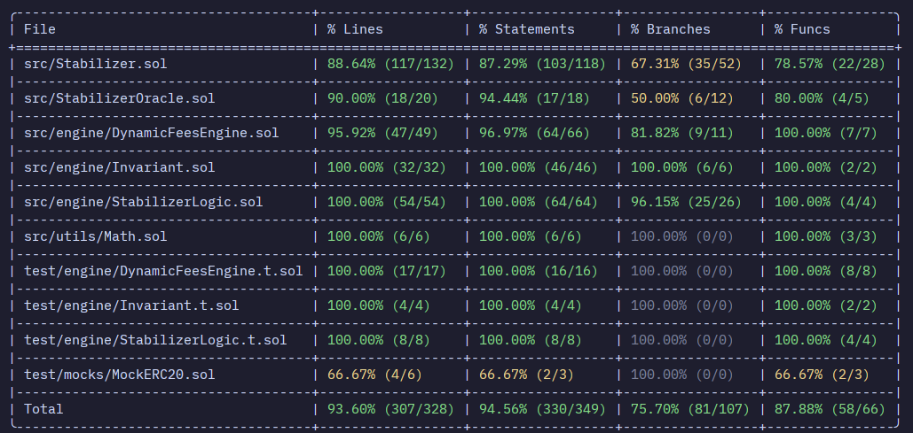

# Stabilizer: Dynamic-Fee Stableswap Liquidity Protocol

A production-grade, highly optimized, non-custodial Stableswap Liquidity Pool and Exchange designed specifically for pegged assets (USDC/USDT). Combining the high-efficiency Curve Stableswap invariant with an innovative real-time Dynamic Fees Engine and robust configurable safety thresholds, Stabilizer represents a state-of-the-art solution to liquidity provision, toxic flow mitigation, and capital efficiency.

---

## Overview

### Problem Statement
Standard Constant Product Market Maker (CPMM) AMMs ($x \cdot y = k$) suffer from high slippage and capital inefficiency when handling pegged assets like stablecoins. While traditional Stableswap models ($x + y$ mixed with $x \cdot y$) significantly reduce slippage, they rely on static swap fees. Static fee models fail to:
1. Penalize trades that severely skew the pool's reserves, leaving the pool vulnerable to structural imbalance.
2. Incentivize arbitrageurs to restore pool balance under high volatility or oracle depeg scenarios.
3. Block toxic flow automatically during extreme stablecoin depeg events, exposing Liquidity Providers (LPs) to significant capital loss (impermanent loss crystallization).

### Solution Provided
**Stabilizer** addresses these vulnerabilities by introducing a multi-tiered, state-aware AMM architecture:
*   **Deep Liquidity Engine**: Implements the Curve Stableswap invariant for two tokens ($n=2$), dramatically reducing slippage for large transactions.
*   **Directional Dynamic Fees Engine**: Computes real-time swap fees that scale quadratically based on reserve imbalance and oracle price deviation. Crucially, it applies **directional adjustments**—discounting fees for stabilizing trades to attract arbitrageurs, while surcharging destabilizing trades to protect LP capital.
*   **Configurable Safety Thresholds (Circuit Breakers)**: Enforces hard limits on reserve imbalance and oracle price deviation, reverting toxic swap transactions before pool drainage occurs.

---

## Key Features

*   **Curve Stableswap Invariant ($n=2$)**: Optimized Newton-Raphson iterative solver for $D$ (equilibrium pool value) and $y$ (target asset balance) in Solidity, capped at $255$ iterations with 1-wei convergence precision.
*   **Real-time Dynamic Fee Calculation**: Swaps are priced using a base fee ($2$ BPS) plus quadratic premiums derived from pool reserve skewness (up to $15$ BPS) and Chainlink oracle price deviation (up to $3$ BPS).
*   **Directional Fee Adjustments**: Offers up to a $5$ BPS fee discount (stabilizing rebate) for swaps that move the pool back toward a $50:50$ ratio, and up to a $10$ BPS surcharge (destabilizing tax) for swaps that increase pool imbalance.
*   **Automatic Circuit Breakers**:
    *   **Max Imbalance Threshold**: Blocks swap transactions that push pool imbalance past a configured threshold (default $80\%$) unless the swap is stabilizing (reducing imbalance).
    *   **Max Price Deviation Threshold**: Automatically pauses swaps if the Chainlink oracle price deviation between USDC and USDT exceeds the configured limit (default $1\%$), protecting LPs from depegged assets.
*   **Robust Security Mechanics**:
    *   **Inflation Attack Shield**: Locks the first $1,000$ wei ($MIN\_LIQUIDITY$) of LP supply by minting it to `0xdead` on first deposit.
    *   **Stale Oracle Price Protection**: Enforces strict heartbeat validation ($24$ hours) on Chainlink feeds, reverting on stale, zero, or negative price data.
    *   **Safe Token Standard Integration**: Employs OpenZeppelin's `SafeERC20` wrapper to safely handle non-standard ERC20 token transfer quirks (e.g., return values of USDT/USDC).
*   **Structural LP Backing Fee Mechanics**: 30% of collected swap fees are sent to the `feeReceiver` (admin/treasury), while 70% of fees structurally accumulate inside the contract, directly increasing the backing value of the STB LP tokens and generating organic yield.

---

## Tech Stack

| Category | Technologies | Description |
| :--- | :--- | :--- |
| **Smart Contracts** | Solidity (`^0.8.33`) | High-level contract language with native checked arithmetic. |
| **Development Suite** | Foundry (Forge & Cast) | Modern EVM toolchain for compiling, testing, and scripting. |
| **Libraries** | OpenZeppelin Contracts | Standard vetted implementations of `ERC20`, `Ownable`, `ReentrancyGuard`, and `SafeERC20`. |
| **Pricing Interface** | Chainlink Data Feeds | `AggregatorV3Interface` integration for high-fidelity asset prices. |
| **CI/CD** | GitHub Actions | Automatic formatting checks (`forge fmt`), build compilation (`forge build`), and test runs (`forge test`). |

---

## Project Structure

The project follows the standard Foundry repository structure, with a modular codebase separation in both the source and test layers:

```text
Stabilizer/
├── .github/
│   └── workflows/
│       └── test.yml                  # CI/CD workflow pipeline
├── foundry.toml                      # Foundry compile, optimizer, and remapping config
├── src/
│   ├── Stabilizer.sol                # Core ERC20 LP and Swap vault contract
│   ├── StabilizerOracle.sol          # Chainlink price feed gateway validator
│   ├── Types/
│   │   └── DataTypes.sol             # Shared parameter structs (FeeParams, ExchangeParams, etc.)
│   ├── engine/
│   │   ├── DynamicFeesEngine.sol     # Dynamic fee calculations & directional adjustments
│   │   ├── Invariant.sol             # Curve Stableswap mathematical invariant solver
│   │   └── StabilizerLogic.sol       # Execution routing library for swaps & liquidity
│   └── utils/
│       └── Math.sol                  # Pure math functions (min, max, absDiff)
└── test/
    ├── Stabilizer.t.sol              # Core contract integration & functional tests
    ├── engine/
    │   ├── DynamicFeesEngine.t.sol   # Unit tests for the fee calculations & tiers
    │   ├── Invariant.t.sol           # Precision & edge case tests for Stableswap math
    │   └── StabilizerLogic.t.sol     # stateless logic and exchange quote tests
    ├── mocks/
    │   └── MockERC20.sol             # Standard ERC20 token mock for local simulations
    └── utils/
        └── Math.t.sol                # Basic library unit tests
```

### Purpose of Key Directories
*   **`src/`**: Houses all production smart contracts.
    *   `Types/`: Declares grouped structs (`ExchangeParams`, etc.) to circumvent Solidity stack-too-deep limits during calculations.
    *   `engine/`: Contains low-level math, fee formulas, and execution components. Keeping these separated in libraries reduces core contract size and prevents deployment bloat.
*   **`test/`**: Implements complete unit and integration tests. Mirroring the `src/` directory layout makes locating and expanding coverage for individual code modules highly intuitive.

---

## Installation

### Prerequisites
1.  **Git**: For cloning the repository.
2.  **Foundry**: Install via standard terminal shell scripts.

### Step-by-Step Setup
1.  **Clone the Repository**:
    ```bash
    git clone https://github.com/GHexxerBrdv/Stabilizer.git
    cd Stabilizer
    ```

2.  **Install Foundry Toolchain** (if not already installed):
    ```bash
    curl -L https://foundry.paradigm.xyz | bash
    foundryup
    ```

3.  **Install Dependencies** (Submodules):
    ```bash
    forge install
    ```

4.  **Build Contracts**:
    ```bash
    forge build
    ```

---

## Environment Variables

To deploy to public networks or run fork testing, copy `.env.example` into a `.env` file (not checked into source control):

| Variable | Purpose | Required |
| :--- | :--- | :--- |
| `RPC_URL` | Endpoint provider for connecting to Target EVM chains (e.g., Ethereum Mainnet, Arbitrum, Base). | Yes (for deployment & fork testing) |
| `PRIVATE_KEY` | EOA deployer private key used to sign transactions. | Yes (for deployment) |
| `ETHERSCAN_API_KEY` | Key used to automatically verify source code on block explorers. | No (optional) |

> **Note:** Never put private key directly in environment variables or commit it to source control either wallet has funds or not.
---

## Running Locally

### Development and Local Compilation
To compile the contracts and output contract ABIs and bytecodes:
```bash
forge build
```

### Running Test Suite
Execute the entire test suite (unit, integration, and revert assertions):
```bash
forge test
```

### Run Tests with Verbose Logging
To view event logs, console outputs, and gas reports during test execution:
```bash
forge test -vvv
```

### Run Specific Test Suites
To run only a specific contract's tests (e.g., Dynamic Fee calculations):
```bash
forge test --match-contract DynamicFeesEngineTest
```

---

## API Documentation

See [ApiDocs.md](ApiDocs.md) for detailed API documentation.

---

## Internal Bookkeeping vs. Contract Balances
Standard AMMs often query `IERC20(token).balanceOf(address(this))` directly to calculate swap outputs, making them highly vulnerable to flashloan-driven price manipulation or "donation attacks" (where tokens are directly transferred to the contract to artificially inflate reserves).

To mitigate this, Stabilizer maintains explicit internal accounting variables:
```solidity
uint256 usdcReserves;
uint256 usdtReserves;
```
Reserves are only modified internally when users deposit, withdraw, or swap via standard protocol interfaces. External direct transfers of USDC or USDT to the contract are ignored by calculations, securing the invariant math from manipulation.

---

## Security Features

Stabilizer integrates a comprehensive suite of security controls designed to handle common smart contract vulnerabilities:

### 1. Reentrancy Protection
All user-facing transactional methods (`addLiquidity`, `removeLiquidity`, `exchange`) utilize the `nonReentrant` modifier from OpenZeppelin's `ReentrancyGuard`. This enforces a mutual exclusion lock, preventing callers from executing recursive call-backs (e.g., standard ERC20 hooks like `transfer` or `fallback` triggers) to drain assets from the contract before the pool's internal reserves are updated.

### 2. Stale Oracle Price Guard (Heartbeat Validation)
Relying blindly on external price data is extremely dangerous if an oracle stops updating. Stabilizer's pricing gateway enforces three layers of validation on oracle calls:
```solidity
(uint80 roundId, int256 price,, uint256 updatedAt,) = AggregatorV3Interface(feed).latestRoundData();
require(price > 0, InvalidPrice());
require(updatedAt > 0, StaleFeed());
require(block.timestamp - updatedAt <= HEARTBEAT, StaleFeed());
```
Swaps automatically revert if the oracle price is non-positive or if the feed was updated more than $24$ hours ago (`HEARTBEAT`), protecting LPs from trading against outdated market rates.

### 3. ERC4626-Style Inflation Attack Mitigation
In typical share-based liquidity vaults, the first depositor can deposit a tiny amount ($1$ wei) and mint $1$ LP share. They can then transfer a large amount of tokens directly to the contract. The pool's exchange rate becomes heavily skewed ($1$ share representing millions of tokens). Subsequent depositors will have their deposits rounded down to $0$ shares, effectively donating their assets to the first depositor.

Stabilizer eliminates this attack vector by introducing a permanent liquidity lock during the pool's very first deposit:
```solidity
if (stbSupply == 0) {
    _mint(LOCKED_LIQUIDITY_HOLDER, MIN_LIQUIDITY); // Mints 1,000 LP tokens to address(0xdead)
}
```
This forces the minimum pool supply to always be at least $1,000$ units, making it economically unfeasible for an attacker to artificially inflate the share price to a point where subsequent deposits suffer from rounding loss.

### 4. Configurable Safety Threshold Circuit Breakers
To prevent extreme systemic failures, the protocol implements hard circuit breakers:
*   **Imbalance Limit**: If reserve skewness exceeds the `maxImbalanceThreshold` (e.g., the pool is $90\%$ USDC and $10\%$ USDT), any further swap that *increases* the skew (i.e. selling USDT to buy USDC) is reverted. Only stabilizing swaps that *restore* balance are allowed.
*   **Price Deviation Limit**: If the oracle price ratio between USDC and USDT deviates past the `maxPriceDeviationThreshold` (e.g., due to an active depeg event of one stablecoin), all swaps are temporarily blocked, halting the pool from acting as a "dumping ground" for the depegged asset.

---

## Performance Considerations

Solidity is an execution-constrained environment where every calculation incurs gas costs. Several gas optimization design patterns are implemented:

### 1. Stateless Library Executions
Libraries (`StabilizerLogic`, `DynamicFeesEngine`, `StabilizerInvariant`) utilize Solidity's `internal` functions. When internal functions are called, the code is compiled directly into the parent contract. This avoids expensive external contract calls (`DELEGATECALL` / `CALL`) which cost substantial base gas ($100$ to $700$ gas per call), minimizing the active swap gas footprint.

### 2. High-Efficiency Newton-Raphson Solver
The iterative Newton-Raphson approximation is heavily optimized:
*   Loops are capped at a hard maximum of $255$ iterations to guarantee termination and prevent infinite loops that could run out of transaction gas.
*   The convergence condition is checked using a minimal delta check (`absDiff(dPrev) <= 1`). Once the precision converges to $1$ wei, the loop terminates immediately, saving thousands of gas units compared to fixed-iteration solvers.

### 3. In-Memory Struct Parameter Passing
Using separate variables inside functions wastes stack slots, frequently triggering Solidity's dreaded "Stack Too Deep" errors. Stabilizer solves this by packing parameters into in-memory structs defined in `DataTypes.sol`:
```solidity
struct ExchangeParams {
    uint256 amount;
    address token;
    address usdc;
    address usdt;
    address oracle;
    uint256 usdcReserve;
    uint256 usdtReserve;
    uint256 amp;
    uint256 maxImbalanceThreshold;
    uint256 maxPriceDeviationThreshold;
}
```
Passing these parameters as a single memory pointer significantly reduces compiler stack pressure and optimizes code execution speed.

---

## Testing

The project maintains a highly comprehensive test suite built in Foundry. The testing strategy prioritizes strict boundary conditions, extreme skews, oracle price deviations, and circuit breaker activations.

### Test Coverage Highlights

The project achieves:



### Running Tests and Coverage Commands
*   **Execute Full Test Suite**:
    ```bash
    forge test
    ```
*   **Check Test Coverage Metrics**:
    ```bash
    forge coverage
    ```

---

## Challenges and Engineering Decisions

### 1. Newton-Raphson Approximation in EVM
*   **The Challenge**: Solidity lacks native floating-point types, meaning all mathematical equations must be computed using integer division. In the Stableswap invariant, calculating the equilibrium pool value $D$ and target balance $y$ requires solving high-order polynomial equations. Simple division runs the risk of catastrophic rounding errors, which can block the loops from converging.
*   **The Decision**: Stabilizer employs a highly refined fixed-point implementation of Curve's iterative Newton-Raphson approximation. We enforce division scaling orders and establish a tight convergence criterion: `if (y.absDiff(yPrev) <= 1)`. If the calculated value converges within $1$ wei (the absolute smallest unit in Solidity), the loop exits immediately. This achieves maximal mathematical precision while avoiding gas exhaustion.

### 2. Imbalance vs. Deviation: Aligning Two Independent Metrics
*   **The Challenge**: A pool's internal reserve imbalance (reserves ratio) and the external oracle price deviation are two distinct metrics. A pool could have a heavy reserve skew ($70:30$) while the external oracle reports a perfect $1.00:1.00$ exchange rate. Conversely, reserves could be perfectly equal ($50:50$) while an external stablecoin starts to depeg.
*   **The Decision**: We designed a decoupled, multi-input pricing model in the `DynamicFeesEngine`. Instead of consolidating skew and price deviation into a single variable, the engine evaluates both metrics independently via quadratic equations and sums their results:
    $$\text{Core Fee} = \text{Base Fee} + \text{Imbalance Fee} + \text{Price Deviation Fee}$$
    This ensures that LPs are fully protected from *both* internal pool skewness and external stablecoin volatility simultaneously.

### 3. Structural LP Backing Fee Mechanics (The 70/30 Split)
*   **The Challenge**: Standard protocols stream 100% of generated trading fees to a treasury address, leaving LPs dependent solely on standard volume rewards. Other protocols compound 100% of fees back into reserves, making it difficult for the platform to fund ongoing operations.
*   **The Decision**: We implemented a unique 70/30 fee distribution mechanism inside `_poolInteraction` and `_applyFee`:
    *   30% of the calculated transaction fee is extracted in real-time and sent directly to the configured `feeReceiver` (protocol treasury).
    *   The remaining 70% of the fee is deducted from the output sent to the swapper but is **not** transferred out of the pool.
    *   Because the internal reserve bookkeeping variables (`usdcReserves` / `usdtReserves`) are decreased by the *entire* quote amount (inclusive of the full fee), but only `outAmount` and `30% * fee` leave the contract, the remaining `70% * fee` accumulates silently in the contract's actual balance.
    *   This structurally backstops the LP tokens. When an LP decides to remove liquidity, their STB shares are burned for a proportional cut of the internal reserve bookkeeping. The accumulated $70\%$ fee surplus sits in the contract as a structural backing buffer, ensuring the actual underlying token balance of the contract always exceeds the bookkept reserves, shielding the protocol from net liquidity drains.

---

## Why This Project Stands Out

### 1. Technical Complexity
Stabilizer solves complex real-world financial mathematics in a resource-constrained, deterministic execution environment (EVM). Implementing high-precision polynomial solvers (Newton-Raphson approximation) without floating-point arithmetic requires a deep understanding of fixed-point precision math, scaling factors, and compiler behavior.

### 2. High-Caliber Production Engineering
Rather than utilizing monolithic, hard-to-maintain files, the project enforces a strict separation of concerns. Storage, business logic, oracle gateways, pricing engines, and mathematics are fully isolated into distinct files and stateless libraries, reflecting standard clean architecture principles.

### 3. Proactive Risk Management
The project treats security as a first-class citizen. It implements state-of-the-art protection against classic smart contract vulnerabilities (Reentrancy, ERC4626 Inflation attacks) and integrates proactive market risk mitigations (stale price feed blocks, maximum skew limits, and oracle depeg circuit breakers) to preserve LP capital.

### 4. Advanced Gas Optimization
Every storage variable is strategically positioned for tight packing, and core mathematical loops are designed with optimized exit criteria. The stateless execution model minimizes expensive cross-contract interactions, proving that the codebase was designed from day one with consumer gas costs in mind.

---

## Summary

*   **Architected a gas-optimized Stableswap protocol** in Solidity using a stateless library design patterns, reducing core contract bytecode size and lowering transaction gas footprints.
*   **Designed and implemented an innovative Dynamic Fees Engine** featuring quadratic pricing premiums and directional fee rebates (up to 5 BPS discount), successfully aligning arbitrage incentives to maintain pool equilibrium.
*   **Engineered multi-layered proactive security frameworks**, including an ERC-4626 inflation attack shield, stale price oracle guards, and dual circuit breakers (hard skew and price deviation limits) to shield LP capital from toxic market events.
*   **Developed a comprehensive test coverage suite** (86 test cases) in Foundry, achieving extensive testing across extreme skew conditions, boundary values, oracle depegs, and mathematical convergence precision.
*   **Integrated automated CI/CD pipelines** using GitHub Actions, ensuring that every codebase modification passes strict linting check compilation audits, and functional integration tests.
